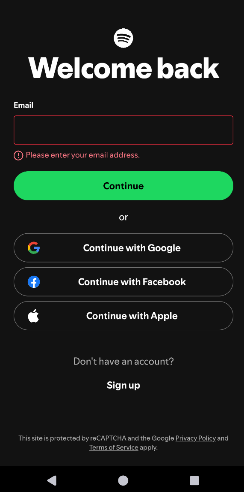
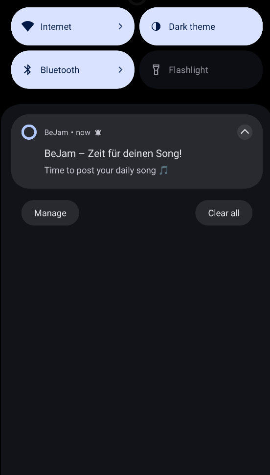
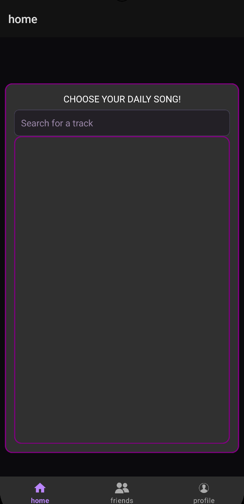
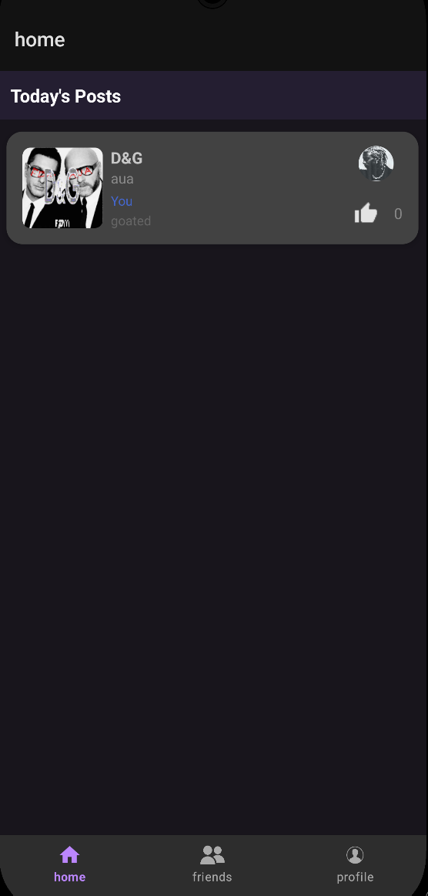
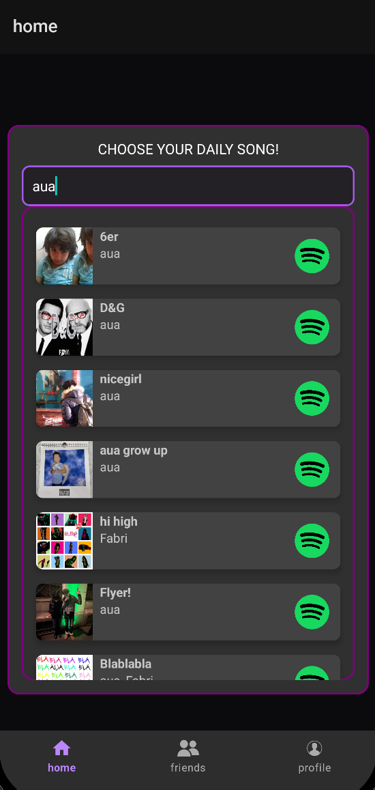
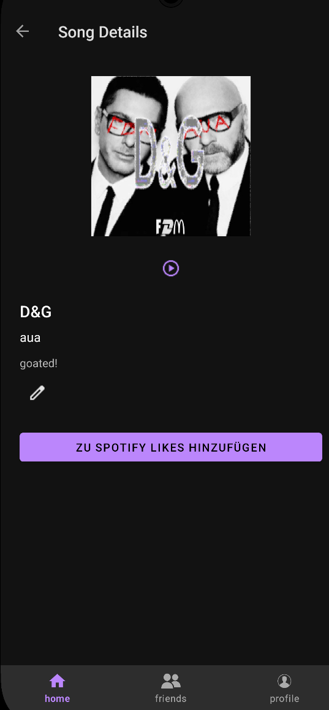

# BeJam 🎵

BeJam is a social music-sharing Android app inspired by "BeReal." Once a day, at a completely random time, every user receives a notification prompting them to share their current favorite song. To encourage engagement, **the social feed is locked**—you can only see what your friends are listening to after you have shared your own song of the day!

---

## 📸 Screenshots (Placeholders)

> [!NOTE]
> Screenshots of the BeJam mobile app will be added here.

| 🔐 Spotify Login | 🔔 Daily Reminder |
| :---: | :---: |
|  <br> *Secure login flow via Spotify accounts* |  <br> *Random push notification alert* |

| 🔒 Locked Feed (Overlay) | 📱 Home Feed (Unlocked) |
| :---: | :---: |
|  <br> *Feed is hidden until you post today's song* |  <br> *List of what your friends are listening to today* |

| 🔍 Spotify Track Search | 🎵 Song Detail & Preview |
| :---: | :---: |
|  <br> *Search for tracks in real-time* |  <br> *View details and play 10s audio previews* |

---

## 🚀 Key Features

* **Daily Music Prompt**: A daily reminder push notification goes out to all users at a random time, resetting the feed and asking users to post a song.
* **Locked Social Feed**: Keeps the community active! The feed overlay in [HomeFragment](file:///c:/Users/phile/OneDrive/Desktop/FH4/BeJam/app/src/main/java/com/example/bejam/ui/home/HomeFragment.kt) hides friends' posts until you share your own song.
* **Spotify Integration**: Direct search using Spotify's Web API via [RetrofitClient](file:///c:/Users/phile/OneDrive/Desktop/FH4/BeJam/app/src/main/java/com/example/bejam/data/RetrofitClient.kt) and secure login managed by [SpotifyAuthManager](file:///c:/Users/phile/OneDrive/Desktop/FH4/BeJam/app/src/main/java/com/example/bejam/auth/SpotifyAuthManager.kt).
* **Audio Previews**: Integrated audio player utilizing ExoPlayer to stream a 10-second snippet of shared tracks directly inside the feed or detail screen ([SongDetailFragment](file:///c:/Users/phile/OneDrive/Desktop/FH4/BeJam/app/src/main/java/com/example/bejam/ui/detail/SongDetailFragment.kt)).
* **Friendship Network**: Send, accept, or decline friend requests, managed seamlessly in the backend database ([FirestoreManager](file:///c:/Users/phile/OneDrive/Desktop/FH4/BeJam/app/src/main/java/com/example/bejam/data/FirestoreManager.kt)).

---

## 🛠️ How It Works (Simplified Overview)

The project connects a mobile client with a cloud-based serverless backend:

1. **Android Client App**: 
   * Authenticates users securely via Spotify OAuth ([AuthCallbackActivity](file:///c:/Users/phile/OneDrive/Desktop/FH4/BeJam/app/src/main/java/com/example/bejam/AuthCallbackActivity.kt)) and signs them into Firebase.
   * Handles local data and caching via Room database ([AppDatabase](file:///c:/Users/phile/OneDrive/Desktop/FH4/BeJam/app/src/main/java/com/example/bejam/data/AppDatabase.kt)).
   * Receives push notifications through the Firebase Messaging Service ([MyFirebaseMessagingService](file:///c:/Users/phile/OneDrive/Desktop/FH4/BeJam/app/src/main/java/com/example/bejam/notifications/MyFirebaseMessagingService.kt)).
2. **Cloud Backend**: 
   * Uses Firebase Cloud Functions ([index.js](file:///c:/Users/phile/OneDrive/Desktop/FH4/BeJam/functions/index.js)) to schedule a daily alarm at a random time.
   * Sends the push notification to everyone via Firebase Cloud Messaging (FCM), which simultaneously wipes the previous day's song selections so a new round can begin.

---

## ⚙️ Initial Configuration & Setup

### 1. Spotify App Settings
1. Log in to the [Spotify Developer Dashboard](https://developer.spotify.com/).
2. Create an App, note your **Client ID**, and set your Redirect URI to:
   ```
   http://127.0.0.1:8888/callback
   ```
3. Copy your Client ID into the code:
   - [SpotifyAuthManager.kt](file:///c:/Users/phile/OneDrive/Desktop/FH4/BeJam/app/src/main/java/com/example/bejam/auth/SpotifyAuthManager.kt#L32)
   - [AuthCallbackActivity.kt](file:///c:/Users/phile/OneDrive/Desktop/FH4/BeJam/app/src/main/java/com/example/bejam/AuthCallbackActivity.kt#L67)

### 2. Firebase Project Settings
1. Create a project in the [Firebase Console](https://console.firebase.google.com/).
2. Add an Android app with the package name `com.example.bejam`, download `google-services.json`, and place it in the `app/` folder.
3. Enable **Email/Password Sign-In**, **Cloud Firestore Database**, and **Cloud Messaging**.

### 3. Deploying the Random Notifications Scheduler
1. Navigate to the `functions/` directory:
   ```bash
   cd functions
   npm install
   ```
2. Log in and initialize your project:
   ```bash
   firebase login
   firebase use --add
   ```
3. Create a Google Cloud Tasks queue named `daily-reminder-queue` in your console or via command line.
4. Deploy the cloud code:
   ```bash
   firebase deploy --only functions
   ```

### 4. Running the Client
Open the project root in **Android Studio**, build, and run the app on an Android device or emulator (Android API 35 or above). Make sure to grant Notification Permissions when prompted.

---

## 📂 Project Structure

```
BeJam/
├── app/                  # Android application module (Kotlin)
│   ├── src/main/java/    # Source files (Auth, Data/Database, UI/Fragments)
│   └── build.gradle.kts  # Client dependencies
├── functions/            # Backend serverless cloud functions (JavaScript)
│   └── index.js          # Notification triggers & daily schedule resets
├── gradle/               # Version catalog settings
└── README.md             # This documentation
```

---

## 📄 License
This project is licensed under the MIT License.
